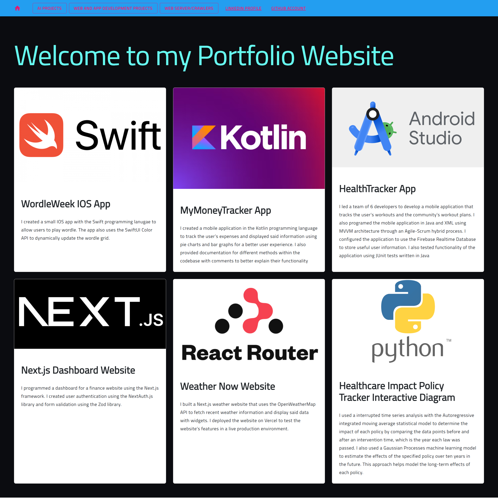
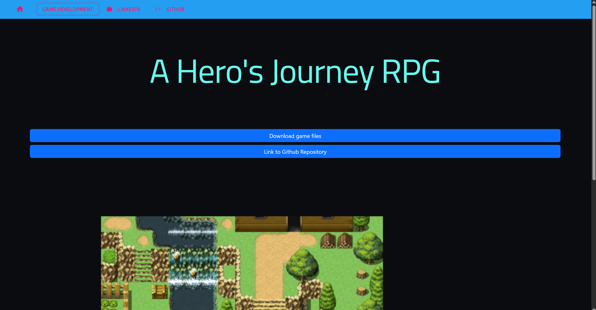
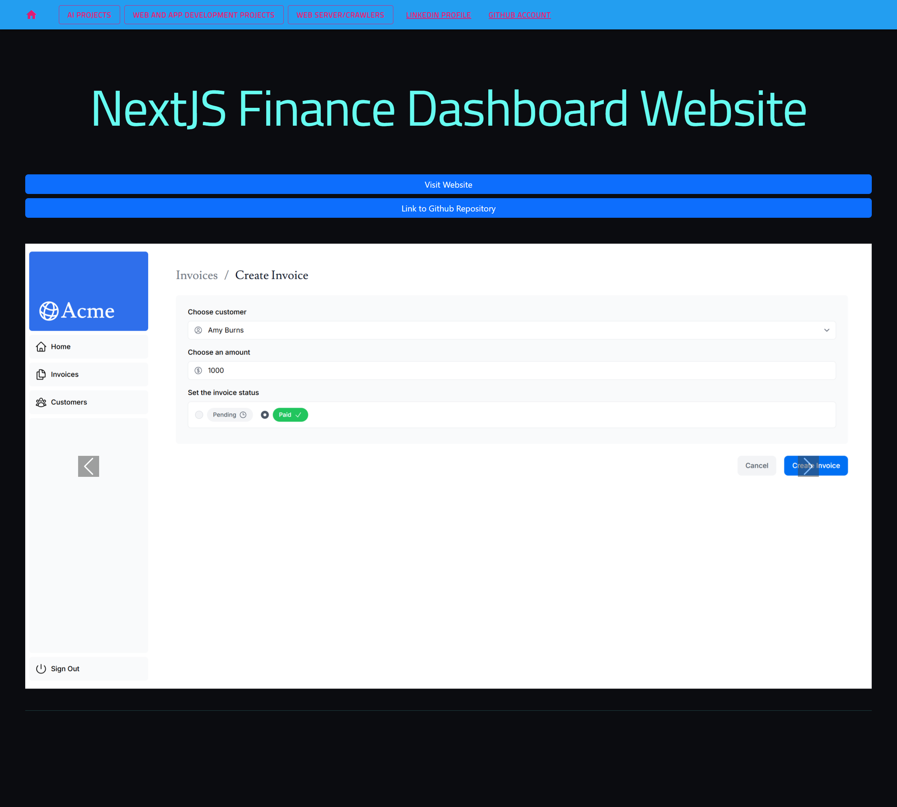

# Portfolio Website - Game Development
An Angular-based website that showcases my game development projects. 

---

## Screens & Demo  
  
  
  

## Visiting the Website
You can visit the link  https://bit.ly/sumukhp_portfolio to access the latest production build of the website.

---

## Features (What You'll See)  
- A grid showcasing game development projects including RPG games, platformer games, and physics-based games
- A page for each game project with demo images, game files for download, and detailed descriptions of gameplay mechanics.

---

## Tech Stack  
- **Language**: Typescript, JavaScript, CSS, HTML
- **Frameworks**: Angular, CSS Tailwind
- **Packages**: Ignite UI for Angular
- **IDE**: Visual Studio Code

---

## Setup (Run in 2 Minutes)  
1. Clone the repository:  
   ```bash
   git clone https://github.com/SumukhP-dev/Portfolio_Website.git
   ```
2. Run 
   ```bash
   npm install
   ```
3. Run 
   ```bash
   ng serve
   ```

---

## License & Contact  
**License:** MIT  

**Author:** Sumukh Paspuleti
- [LinkedIn](https://www.linkedin.com/in/sumukh-paspuleti/)  
- [Email](mailto:spaspuleti3@gatech.edu)  
